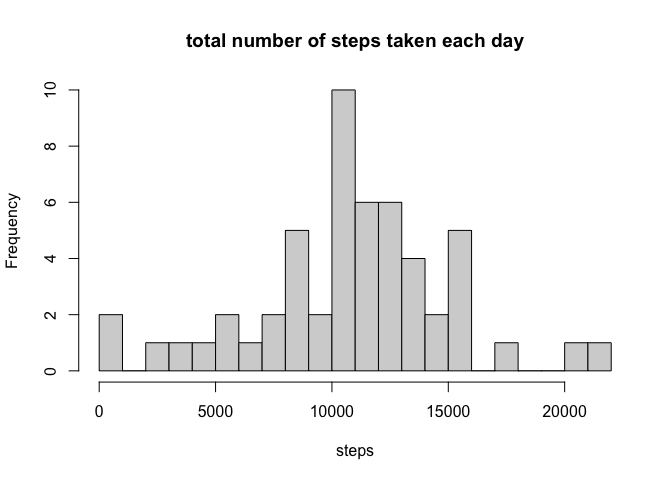
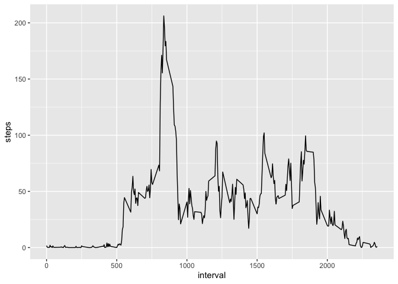
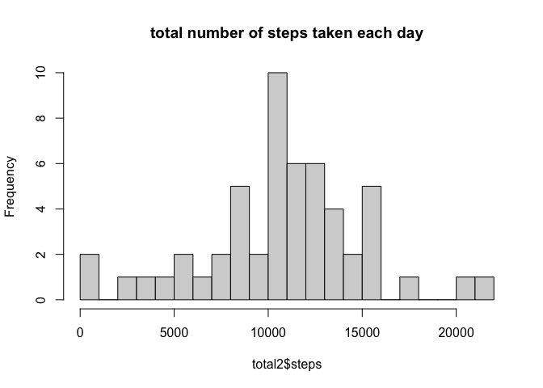
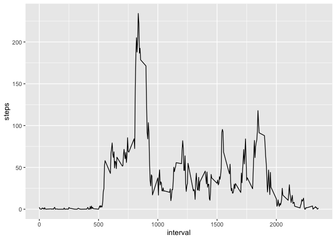
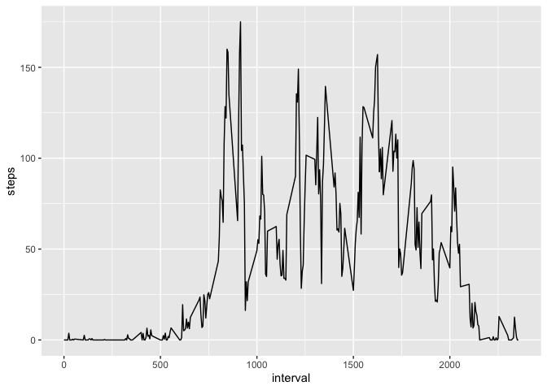

## Loading and preprocessing the data
        
### Prepare Dataset

```r
library(dplyr)
```

```
## 
## Attaching package: 'dplyr'
```

```
## The following objects are masked from 'package:stats':
## 
##     filter, lag
```

```
## The following objects are masked from 'package:base':
## 
##     intersect, setdiff, setequal, union
```

```r
library(ggplot2)
setwd("~/Desktop/RStudio Files/RepData_PeerAssessment1")
unzip("~/Desktop/RStudio Files/RepData_PeerAssessment1/activity.zip")
data <- read.csv("~/Desktop/RStudio Files/RepData_PeerAssessment1/activity.csv")
head(data)
```

```
##   steps       date interval
## 1    NA 2012-10-01        0
## 2    NA 2012-10-01        5
## 3    NA 2012-10-01       10
## 4    NA 2012-10-01       15
## 5    NA 2012-10-01       20
## 6    NA 2012-10-01       25
```
### Omit NA values from Dataset

```r
data1 <- na.omit(data)
```

## What is mean total number of steps taken per day?

### Calculate the total number of steps taken per day

```r
total <- data1 %>% group_by(date) %>% summarise(steps = sum(steps))
```

```
## `summarise()` ungrouping output (override with `.groups` argument)
```
### Make a histogram of the total number of steps taken each day

```r
hist(total$steps, breaks = 30, main = 'total number of steps taken each day', xlab = "steps")
```

<!-- -->
### Calculate and report the mean and median of the total number of steps taken per day

```r
median(total$steps)
```

```
## [1] 10765
```

```r
mean(total$steps)
```

```
## [1] 10766.19
```

## What is the average daily activity pattern?

### Make a time series plot

```r
average <- data1 %>% group_by(interval) %>% summarise(steps = mean(steps))
```

```
## `summarise()` ungrouping output (override with `.groups` argument)
```

```r
ggplot(data = average, aes(interval, steps)) + geom_line()
```

<!-- -->
## Which 5-minute interval, on average across all the days in the dataset, contains the maximum number of steps?

```r
average[average$steps==max(average$steps),]
```

```
## # A tibble: 1 x 2
##   interval steps
##      <int> <dbl>
## 1      835  206.
```

## Imputing missing values

### Calculate and report the total number of missing values in the dataset 

```r
sum(is.na(data$steps))
```

```
## [1] 2304
```
### Devise a strategy for filling in all of the missing values in the dataset.

```r
names(average)[2] <- "mean.steps"
data2 <- merge(data1,average)
```
### Create a new dataset that is equal to the original dataset but with the missing data filled in.

```r
data2$steps[is.na(data2$steps)] <- data2$mean.steps[is.na(data2$steps)]
```
### Make a histogram of the total number of steps taken each day and Calculate and report the mean and median total number of steps taken per day.

```r
total2 <- data2 %>% group_by(date) %>% summarise(steps = sum(steps))
```

```
## `summarise()` ungrouping output (override with `.groups` argument)
```

```r
hist(total2$steps, breaks = 30, main = 'total number of steps taken each day')
```

<!-- -->

```r
mean(total2$steps)
```

```
## [1] 10766.19
```

```r
median(total2$steps)
```

```
## [1] 10765
```

## Are there differences in activity patterns between weekdays and weekends?

### Create a new factor variable in the dataset with two levels – “weekday” and “weekend” indicating whether a given date is a weekday or weekend day.

```r
data2$day <- weekdays(as.Date(data2$date))
data2$type <-as.factor(data2$day=="Saturday"|data2$day=="Sunday")
levels(data2$type) <- c("Weekday", "Weekend")
```
### Make a panel plot containing a time series plot

```r
weekday <- data2 %>% filter(type=="Weekday") %>% group_by(interval) %>% summarise(steps = mean(steps))
```

```
## `summarise()` ungrouping output (override with `.groups` argument)
```

```r
ggplot(weekday,aes(interval,steps)) +geom_line()
```

<!-- -->

```r
weekend <- data2 %>% filter(type=="Weekend") %>% group_by(interval) %>% summarise(steps = mean(steps))
```

```
## `summarise()` ungrouping output (override with `.groups` argument)
```

```r
ggplot(weekend,aes(interval,steps)) +geom_line()
```

<!-- -->
